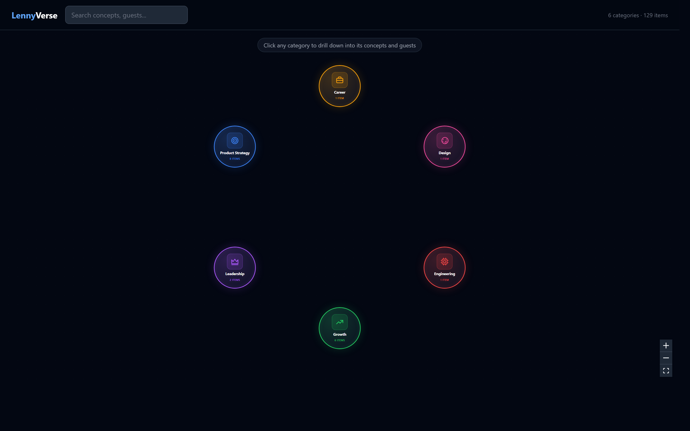
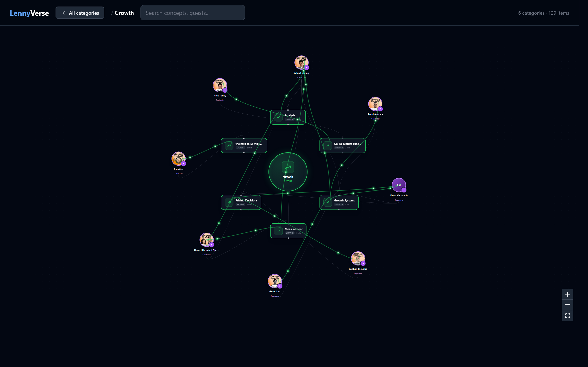

# LennyVerse

**The living knowledge graph of product management wisdom.**

A zoomable, pannable canvas mapping every guest, concept, and framework from Lenny's Newsletter and Podcast into six domain clusters. Built on [Karpathy's LLM wiki pattern](https://gist.github.com/karpathy/442a6bf555914893e9891c11519de94f) and [graphify](https://github.com/safishamsi/graphify)'s 3-pass extraction pipeline.



## What it does

- **Six category hubs at rest.** Click any one to drill into its concepts and connected guests. Click again (or "All categories") to collapse back.
- **Real guest headshots on every node.** Pulled from Lenny's podcast RSS feed (`api.substack.com/feed/podcast/10845.rss`) — each `<itunes:image>` contains the guest's face. Same trick [LennyRPG](https://www.lennysnewsletter.com/p/how-i-built-lennyrpg) used. `scripts/fetch_guest_images.py` maps 286 guests and 338 episode covers straight from Substack's CDN.
- **Click a guest → side panel** with episode cards, each showing the real episode cover art.
- **Click an episode card → in-panel summary** with the lead hook pulled verbatim, a "Main ideas" bullet list extracted from the episode description, clickable concept tags, and a "Listen on Lenny's Newsletter" CTA.
- **Click a concept → detail panel** showing which guests teach it and related concepts.
- **Wisdom beams** — hover any concept, guest, or the category hub inside an expanded view and glowing particles stream along the edges, showing the teach relationships in motion.
- **Ask Claude** — grounded Q&A over the compiled wiki, streamed via SSE.



## Architecture

Three layers:

```
knowledge/raw/          immutable input — Lenny's starter pack (gitignored per license)
  ├─ newsletters/       10 posts
  ├─ podcasts/          50 transcripts
  └─ index.json         titles, guests, dates, descriptions

knowledge/wiki/         compiled knowledge pages (gitignored)
  ├─ concepts/          one .md per concept with YAML frontmatter
  ├─ guests/            one .md per guest
  ├─ sources/           one .md per episode with Lenny URL
  └─ domains/           one .md per domain cluster
```

The compiler runs three passes:

1. **Structure extraction** — parses `index.json` for titles/guests/dates and pulls concept topics from `covering X, Y, Z` patterns
2. **Semantic extraction** (Claude or Ollama) — extracts frameworks, relationships, tensions from transcripts
3. **Community detection** (Leiden on `python-igraph`) — discovers domain clusters from edge topology

## Quick start

### Prerequisites

- Python 3.12
- Node.js 20+
- One LLM backend — Anthropic Claude API key **or** local [Ollama](https://ollama.com) (see [LLM backends](#llm-backends))

### 1. Clone and install

```bash
git clone https://github.com/Peaky8linders/lennyverse
cd lennyverse

python -m venv .venv && source .venv/bin/activate   # Windows: .venv\Scripts\activate
pip install -r backend/requirements.txt

cd frontend && npm install && cd ..
```

### 2. Get Lenny's starter pack

Lenny's license forbids redistributing the raw data, so you download it yourself:

```bash
git clone https://github.com/LennysNewsletter/lennys-newsletterpodcastdata /tmp/lennys-data
python scripts/seed_raw.py /tmp/lennys-data
```

### 3. Fetch guest headshots (one-time, ~5s)

```bash
python scripts/fetch_guest_images.py
```

Writes `frontend/public/guest_images.json` and `episode_images.json` from Lenny's podcast RSS feed.

### 4. Compile the wiki

```bash
# A) Anthropic Claude — ~60s, richest graph
ANTHROPIC_API_KEY=sk-... python scripts/compile.py

# B) Local Ollama — pick a model from the table below
export OLLAMA_MODEL=qwen2.5:32b
python scripts/compile.py
```

### 5. Run the app

```bash
# Terminal 1 — backend on :8080
cd backend && uvicorn app.main:app --reload --port 8080

# Terminal 2 — frontend on :5173
cd frontend && npm run dev
```

Open **http://localhost:5173**.

## Usage

- **Overview** — drag to pan, wheel to zoom, click any category hub to drill in
- **Expanded** — selected hub at center, concept pills in an inner ring, guest headshots in an outer ring. Back button in the header returns to overview.
- **Wisdom beams** — hover any node in the expanded view to fire glowing particle streams along its edges. Hover the central hub to light every edge at once. Append `?beam=<node-id>` to the URL (e.g. `?expand=Growth&beam=domain:Growth`) to pre-seed the effect for screenshots.
- **Detail panel** — clicking a guest or concept opens it on the right with related items and an "Ask Claude" Q&A box
- **Episode summary** — clicking an episode card inside a guest's panel opens an in-panel summary with the hook sentence, main-idea bullets, linked concepts, and a "Listen on Lenny's Newsletter" CTA
- **Search** — top-left bar matches guests, concepts, and categories; picking a result drills into its domain
- **Deep-link an expanded view** — `?expand=<DomainLabel>` loads straight into that category, e.g. `http://localhost:5173/?expand=Growth`

## LLM backends

The compiler and `/api/explore` endpoint pick a backend at runtime:

| You set | Backend used |
|---|---|
| `ANTHROPIC_API_KEY` | Anthropic Claude |
| _(nothing)_ | Ollama at `$OLLAMA_URL` |

### Anthropic Claude

```bash
export ANTHROPIC_API_KEY=sk-...
python scripts/compile.py          # ~60s, 5 files in parallel
cd backend && uvicorn app.main:app --reload --port 8080
```

Compile and Q&A default to `claude-sonnet-4-6-20250514`. Override with `COMPILE_MODEL` / `EXPLORE_MODEL`.

### Ollama

```bash
unset ANTHROPIC_API_KEY
ollama pull qwen2.5:32b           # or llama3.1:8b on 16 GB Macs
export OLLAMA_MODEL=qwen2.5:32b
python scripts/compile.py
```

Runs locally with Metal on Apple Silicon. Set `OLLAMA_URL=http://host:11434` to point at a remote daemon.

## API

| Method | Path | Purpose |
|---|---|---|
| `GET` | `/api/graph` | Full graph: nodes, edges, domains |
| `GET` | `/api/node/{id}` | Detail for a single node including frontmatter |
| `POST` | `/api/explore` | Claude Q&A grounded in the wiki (SSE streaming) |
| `POST` | `/api/ingest` | Add new content — LLM auto-wires it into the graph |
| `GET` | `/health` | Status + wiki state |

## Environment variables

| Variable | Default | Purpose |
|---|---|---|
| `ANTHROPIC_API_KEY` | — | Claude API for compile + Q&A |
| `OLLAMA_URL` | `http://localhost:11434` | Ollama endpoint |
| `OLLAMA_MODEL` | `llama3.2:3b` | Ollama model |
| `COMPILE_MODEL` | `claude-sonnet-4-6-20250514` | Override Claude compile model |
| `EXPLORE_MODEL` | `claude-sonnet-4-6-20250514` | Override Claude Q&A model |
| `CORS_ORIGINS` | `http://localhost:5173` | Allowed frontend origins (prod only) |
| `PORT` | `8080` | Backend port |
| `RATE_LIMIT` | `10/minute` | Per-IP SlowAPI limit |

## Deployment

**Backend → Railway.** `backend/Dockerfile` + `backend/railway.toml`. Set `ANTHROPIC_API_KEY` and `CORS_ORIGINS` via `railway variables set`.

**Frontend → Vercel.** `frontend/vercel.json` rewrites `/api/*` to `BACKEND_URL`. `cd frontend && vercel deploy`.

## License

MIT for this project's source code. Lenny's dataset is **not redistributed** here — download it yourself from the [official repo](https://github.com/LennysNewsletter/lennys-newsletterpodcastdata), which is governed by [Lenny's starter-dataset license](https://github.com/LennysNewsletter/lennys-newsletterpodcastdata/blob/main/LICENSE.md).

## Credits

- [Andrej Karpathy's LLM Knowledge Base gist](https://gist.github.com/karpathy/442a6bf555914893e9891c11519de94f) — wiki architecture
- [graphify](https://github.com/safishamsi/graphify) — 3-pass extraction pattern
- [Lenny Rachitsky](https://www.lennysnewsletter.com) — for releasing the dataset
